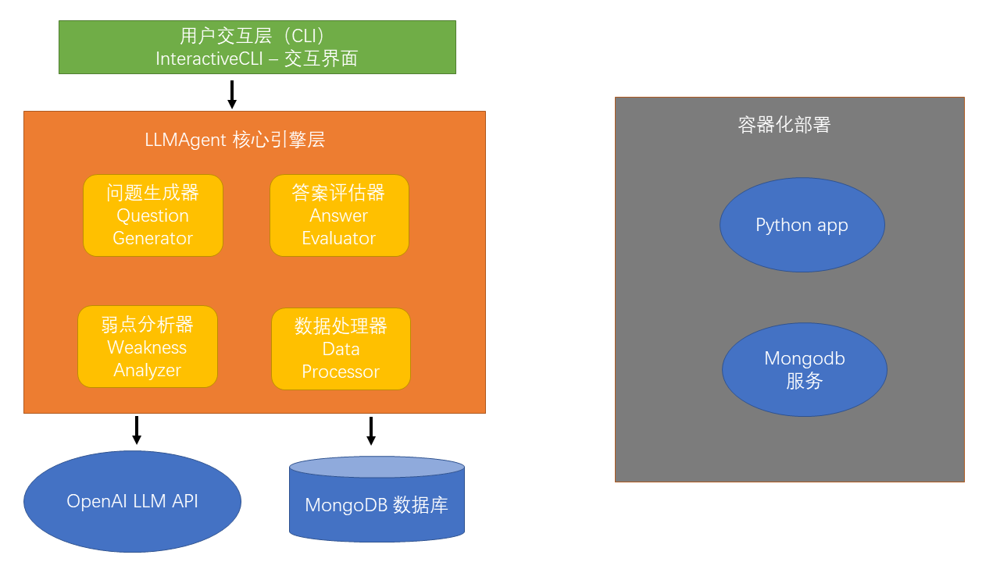
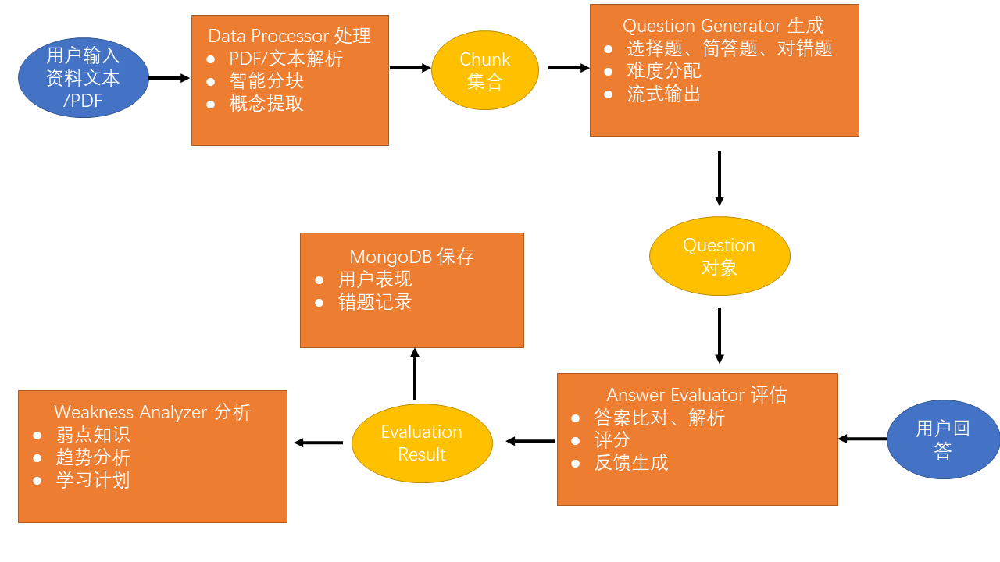

# ai-quiz
**LLMAgent 学习评估与巩固系统**是一个基于大型语言模型（LLM）的个性化学习智能体系统，通过 cli 与用户交互，能够自动生成评估题目、智能判卷、分析学习弱点，并提供个性化学习建议。

---

## 项目架构概述
### 架构图示


### 数据流动图


### CI/CD 工作流

- **pytest** - 自动化测试（`.github/workflows/pytest.yml`）
- **Docker Build & Push** - 镜像构建和推送（`.github/workflows/docker-publish.yml`）

## 详细的技术文档

- [系统架构设计](./doc/ARCHITECTURE.md) - 详细的架构文档和云原生组件说明
- [LLM Agent 智能体策略](./doc/AGENT_STRATEGY.md) - Prompt 模板、设计过程和工具链
- [测试说明](./test/README.md) - 测试套件和单元测试指南


## 如何运行
### 第一步：docker-compose.yml
- 下载或复制 [docker-compose文件](docker-compose.yml) 到本地
- 修改文件中第二个镜像的 tag（28行），确保使用最新的镜像版本。

>```yaml
>    image: ghcr.io/noob-num17/ai-quiz:sha-aa41652  # 替换为最新的镜像 tag
>```
> **注意**：镜像 tag 可能会更新。请根据最新的 GitHub Actions 构建结果替换 `sha-aa41652`。
> 
> 查看最新 tag：
> ```bash
> # 方式1：查看 GitHub Packages
> # https://github.com/noob-num17/ai-quiz/pkgs/container/ai-quiz
>
> # 方式2：通过命令行
> docker search ghcr.io/noob-num17/ai-quiz
> ```

- (可选) 修改环境变量配置。
    - docker-compose.yml 文件中的环境变量配置说明

    | 变量 | 说明 | 默认 |
    |------|------|------|
    | `OPENAI_API_KEY` | OpenAI API 密钥（可选，如果我的key还能用） | `sk-hxpkpcjxfgysnggjprvnognsoplbejgjvgntthsqkofcmnvz` |
    | `OPENAI_BASE_URL` | OpenAI API 端点（可选） | `https://api.openai.com/v1/` |
    | `OPENAI_MODEL` | 使用的Chat模型（可选） | `deepseek-ai/DeepSeek-V3.2` |


#### 第二步：运行应用

在终端中运行以下命令：

```bash
# 启动容器组
docker compose up -d

# 进入容器
docker attach learning-agent-app

# 停止容器
docker compose down
```

---

## 项目分工
- 组内均分
- 邓锦：主要负责 Agent，cli命令行，pytest 的代码实现。
- 施煦屹：只要负责架构设计，Dockerfile，CI/CD，文档等其他的实现。
